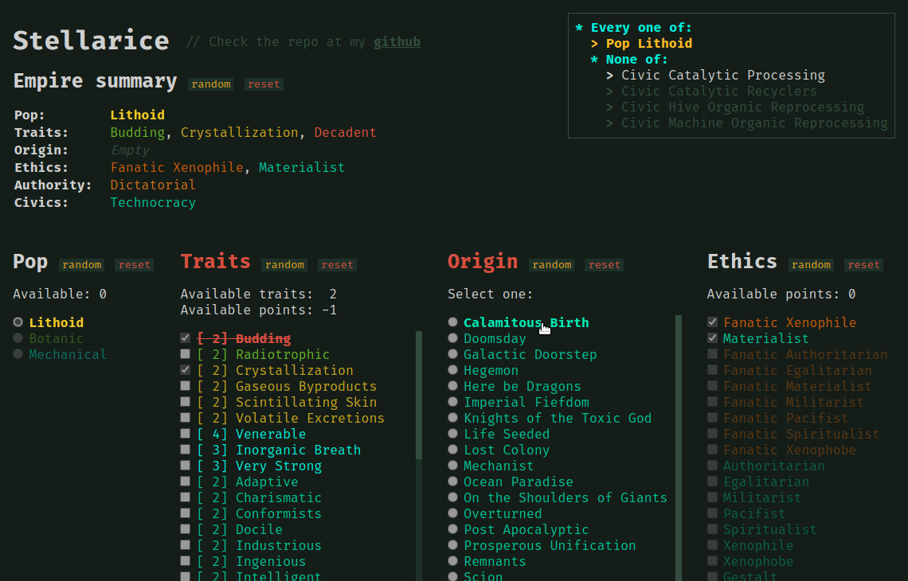

# Stellarice

A simple empire creator and constraints checker for
[Stellaris](https://www.paradoxinteractive.com/games/stellaris).

Try it out on the [stellarice.github.io](https://grzegorz-chojnacki.github.io/stellarice)!

All rules were implemented according to the [wiki](https://stellaris.paradoxwikis.com/)
and *should be* compatible with patch [3.5.3](https://stellaris.paradoxwikis.com/Patches).

## Features

The creator currently supports:
- Basic creation of an empire (pop type, traits, origin, ethics, authority and civics)
- Random generation of a whole empire or specific attributes
- Constraints validation
- Automatical saving of the current empire preset (in the browser's local storage)
- Highlighting related options
- Displaying validity rules for each option
- Minimalistic empire summary
- *Extremely fast loading times, no bloated JavaScript frameworks*

## The reasoning

I've wanted to create a simple tool for tracking what options are available to
pick when designing an empire. Since I don't have all DLCs (but I still play
with them in online sessions), I couldn't just use the built-in creator in the
game.

This is only meant to show a summary of what is currently allowed to be picked,
and to quickly check the rules if you are unsure why something is not available.

If you want to know the details and modifiers of each option you should check
out the wiki.
